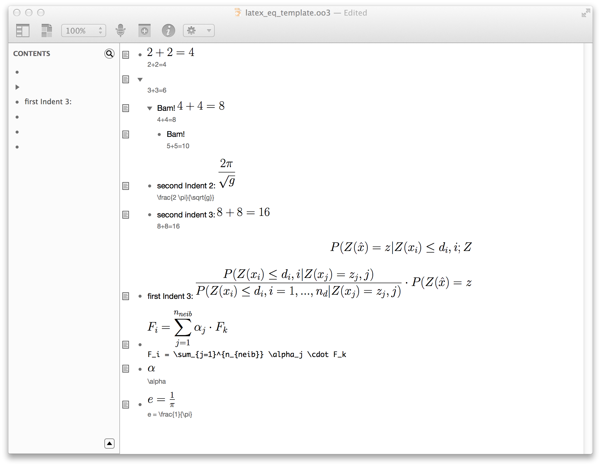

OO_latex
========

# Instructions:

- put the two files `OO_latex.scpt` and `create_latex_pdf.py` into `~/Library/Scripts/OmniOutliner`
- then you can access the script from the script icon in the menubar
- to call the script, I use QuickSilver, as described [here](http://www.macosxtips.co.uk/index_files/run-applescripts-with-keyboard-shortcuts.php)

# This script does:

- gets content of note of selected row
     this should be a latex - math command
- passes the string of this content to a python script
     that generates a pdf of the latex string
- pastes a pdf of your latex string at the end of the selected row (not the note, the note stays there, found to be useful for future reference)

# This script requires

- a valid pdflatex installation, which is in the PATH variable set in ~/.bash_profile
- python with packages sys, os, datetime, time
- [pdfcrop][pc]
- ghostscript (for Yosemite see [here][gs])

# Thanks!

This script was possible with the help of these forum posts

- at [the apple forum][1] for help with the os.system call
- at the omnigroup forum
	- regarding the [idea in general][2]
	- [pasting an attachment into a cell][3]
	 

 [1]: https://discussions.apple.com/thread/5873254
 [2]: http://forums.omnigroup.com/showthread.php?t=31158&highlight=latex
 [3]: http://forums.omnigroup.com/showthread.php?p=129533#post129533
 [gs]: http://pages.uoregon.edu/koch/
 [pc]: http://pdfcrop.sourceforge.net