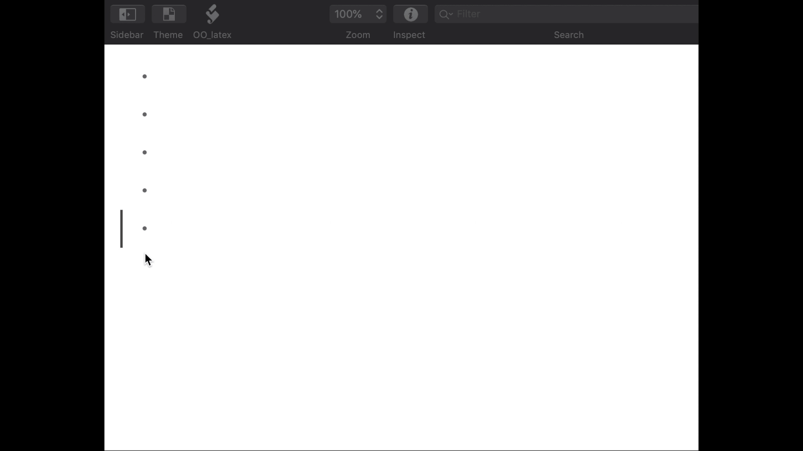
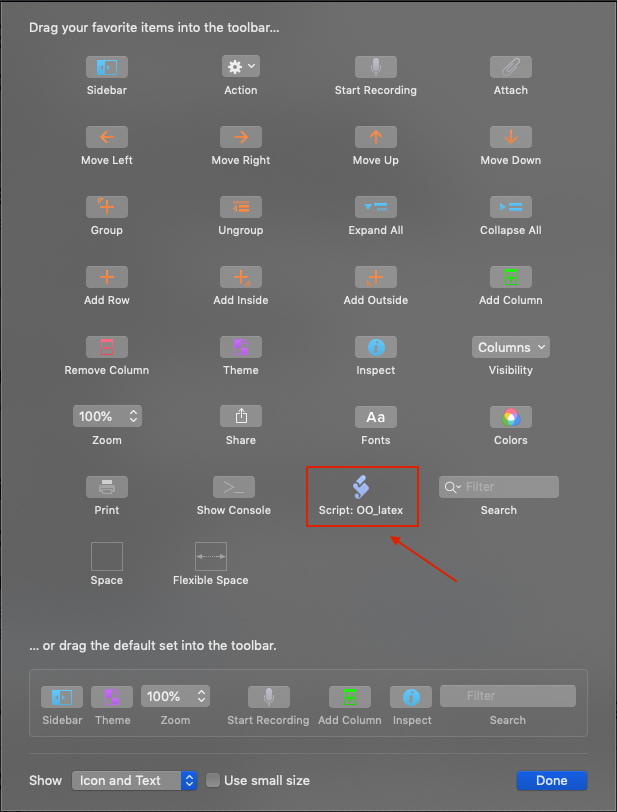
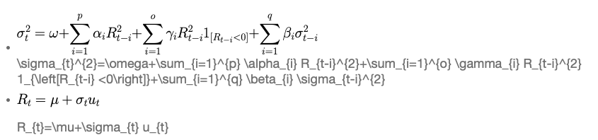

目录
=================
   * [介绍](#介绍)
   * [预安装](#预安装)
      * [第一步: 安装 Python 3](#第一步-安装-python-3)
      * [第二步: 安装 ghostscript](#第二步-安装-ghostscript)
      * [第三步: 安装 PDFCrop](#第三步-安装-pdfcrop)
      * [第四步: 安装 PDFLatex](#第四步-安装-pdflatex)
         * [MacTex](#mactex)
         * [BasicTeX](#basictex)
   * [手动设置](#手动设置)
      * [下载并移动文件](#下载并移动文件)
      * [操作方法](#操作方法)
   * [感谢](#感谢)

在 OmniOutliner 中使用 Latex
========
[](https://github.com/Hephaest/OO_latex/blob/master/LICENSE)
[](https://www.python.org/downloads/release/python-381/)
[](https://support.apple.com/kb/DL2015?locale=en_US&viewlocale=en_US)
[](http://www.omnigroup.com/releasenotes/omnioutliner-mac)

中文 | [English](README.md)

<p align="center"></p>

# 介绍
本仓库介绍了一种可以在 OmniOutliner 中显示 Latex 生成的公式的方法，OmniOutliner 到目前为止并没有原生的解决方法。这篇指南会引导您一步一步配置环境，尤其是没有任何编程背景的朋友们。您唯一需要注意的一点是这项功能能使用的前提是在 `macOS X` 操作系统的环境下。
# 预安装
为了确保 Latex 生成的结果能够在您的 OmniOutliner 中成功显示，您需要安装以下几个安装包。
## 第一步: 安装 Python 3
虽然当前 macOS X 下自带的版本还是 `Python 2.7` 。但是众所周知自 [2020](https://pythonclock.org/) 年后官方将不再维护 `Python 2.7` 了。鉴于这种情况，您需要安装一个版本在 3.+ 之上的 Python 解释器。如果您电脑上还没有相对应的 Python 版本的话，不妨[点击这里开始下载](https://www.python.org/ftp/python/3.8.1/python-3.8.1-macosx10.9.pkg) `Python 3.8.1`。
## 第二步: 安装 ghostscript
`ghostscript` 是一个对 `PDFCrop` 不可或缺的包。如果您的电脑上还没有安装过这个包的话，不妨[点击这里开始下载](https://pages.uoregon.edu/koch/Ghostscript-9.50.pkg)。
## 第三步: 安装 PDFCrop
正如 [**Eric Doviak**](http://pdfcrop.sourceforge.net/) 所说:
> PDFCrop 是一个 Perl 脚本，可裁剪 PDF 页面的空白边距并重新缩放它们以适合标准尺寸的纸张。它使印刷的页面更具吸引力！

如果您的电脑上还没有安装过这个包的话，不妨[点击这里开始下载][Click here to download](https://github.com/Hephaest/OO_latex/raw/master/downloads/pdfcrop_v0.4b.tar.gz)。 安装完后，将压缩包解压并把程序移动到合适的文件夹里 (比如我把文件存在 `Users` 的路径之下)。或者，你可以通过 root 权限将 `pdfcrop` 移动到 `/usr/local/bin/` 目录之下。然后，把程序重命名为 `pdfcrop` 并打开终端以输入以下命令:
```terminal
cd "your path for this folder"
sudo su
chmod 755 pdfcrop
```
## 第四步: 安装 PDFLatex
根据 [StackExchange](https://superuser.com/questions/1038612/where-do-i-get-the-pdflatex-program-for-mac) 上的经验分享，目前有两种主流的方式用于安装 `pdflatex` 到 macOS X。 

### MacTex
第一个是 `MacTex`。MacTex 是官方[推荐的](https://www.latex-project.org/get/) 针对 macOS X 的 Latex 免费软件。然而，该文件的大小超过 4 G，这样的安装要求对于这个小功能而言显然是大材小用了。但是如果您是 Latex 爱好者，请进行享受 MacTex 带来的愉快体验！

如果您的电脑上还没有安装过这个包的话，不妨[点击这里开始下载](http://tug.org/cgi-bin/mactex-download/MacTeX.pkg) 或者您是 [brew](https://brew.sh/) 用户的话，您可以在终端输入下方的指令以安装程序：
```terminal
brew cask install mactex
```
### BasicTeX
另外一个是 `BasicTeX`。BasicTeX 也提供了 `pdflatex` 的安装并且由于它没有 GUI 的功能所以程序总体要比 MacTex 小很多。

我没有试过这种方式，但是如果您是 [brew](https://brew.sh/) 用户的话，您可以在终端输入下方的指令尝试安装：
```terminal
brew cask install basictex
```
# 手动设置
除了以上4步以外，我们只需再进过两步就能完成安装啦！
## 下载并移动文件
1. 首先，请从本仓库下载 `OO_latex.scpt` 和 `create_latex_pdf.py` 这两个文件。

2. 其次，将文件 `OO_latex.scpt` 移动到 `~/Library/Application Scripts/com.omnigroup.OmniOutliner5` (小提示: 这个文件夹默认情况下是被隐藏的，您可以通过 **Finder** 的 **Go** 搜寻这个路径以找到相对应的文件)。 

这个脚本包含以下功能 (引用 **Claus Haslauer** 的原话):
- 获取所选行的注释内容，这一行必须是 Latex 的数学公式代码。
- 将内容通过字符串的方式传递给 python 脚本，这将生成相对应的 pdf 文件
- 将生成的 pdf 裁剪后粘贴到所选行的末尾 (注释那行并不会被改变，生成完后可删除)。

3. 接着，将文件 `create_latex_pdf.py` 移动到 `~/Documents/OmniOutliner5/` (如果该文件夹不存在请创建一个)。

最后，打开任意一个 OmniOutliner 的文档，点击 `View → Customize Toolbar...`，然后您可以找到您的脚本，如以下屏幕截图所示。

<p align="center"></p>

## 操作方法
恭喜您！如果您阅读到这一步的话说明您已经配置成功啦！在之后的使用中， 你只需要在 **注释** 中写下您的 Latex 公式 然后工具栏上相对应的脚本图标，静待3秒钟后您就可以在对应的标题看到生成的结果啦，结果如图所示。

<p align="center"></p>

# 感谢
这篇指南是在 [Yu Wang](https://github.com/wyhitcs/Latex_in_OO) 和 [Claus Haslauer](https://github.com/clausTue/OO_latex) 的成果基础上整合的。
